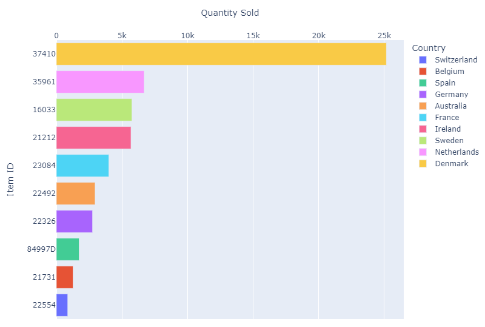
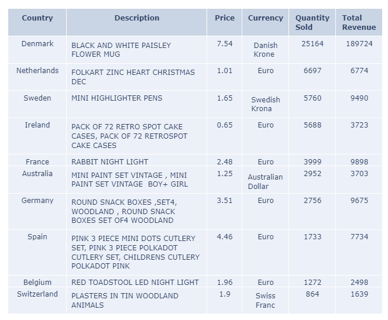

## Sales Analysis for UK-based Online Shop
Ironhack Week 4 SQL Project 
by Reetu & Tobias

### Data
Sales Data taken from: [UCI Online Retail II](https://archive.ics.uci.edu/dataset/502/online+retail+ii) 
Currency Data retrieved via API from: [ExchangeRate-API](https://www.exchangerate-api.com/) 
Country Data web-scraped from: [IBAN.com](https://www.iban.com/currency-codes)

### Business Problem
An online store loacted in the UK is aiming to expand its customer base beyond the bordes of the UK. In order to achieve this, the company wants to optimize their online advertising. As some sales data for non-UK orders exists, this data is used to define the optimal ad placements.

### Objectives
- Identify top 5 non-UK countries with the highest revenues
- Define top selling items for the top 5 countries
- Calculate unit price in local currency for the top 5 countries

### Database

#### Entity Relationship Diagram

### Results

#### Top 10 Non-UK Countries

#### Top Selling Items

#### Unit Price in Local Currency

### Summary

* Collected data from multiple sources.
* Populated tables of MySQL SCHEMA with data imported from Data Frames using a Python notebook.
* Executed table joins and other operations as per project objectives.
* Exported the resulting tables back to the Python notebook for further analysis.
* Conducted Exploratory Data Analysis (EDA): 
  * Identified the top 10 non-UK countries with the highest sales revenue.
  * Determined the highest-selling items in these top countries.
  * Calculated the prices of these items in local currencies, facilitating marketing strategies  with local vendors to maintain competitive pricing.
  

[Link to Presentation](https://docs.google.com/presentation/d/1KHMgHWfQ5uZsA9HIF6PASlYT1JzYIIiTCUx7vPKSMnU/edit?usp=sharing)

